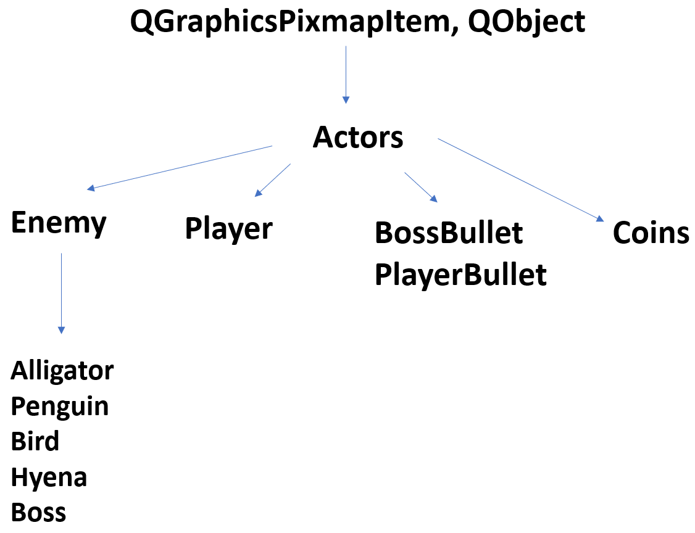
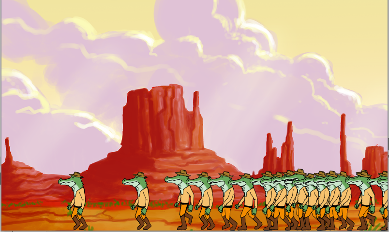

# QtGame

The game is a shooter, where you can only jump (space), shoot (a) and reload (r).
Each time you kill a monster the score increase, at 100 a boss spawns and it can throw bullets.
When an enemy dies, it throws a coin, each 10 coins your maximum ammo is increased.

A ratio is related to the velocity of the monsters, higher the score is, fasters the monters are.

I'll do a little overview of the architecture of the classes, if you want any specification, I invite you to directly check the code, I tried to make it clearer as possible.

Latest update - The person who designed the caracters and the background sold them ! Therefore I'm not authorized to use them anymore. 

## Classes
Here is the hierarchy of my different QGrahicsPixmapItem and QObject :

I tried to add the necessary modularity withour excess e.g. I could have create a bullet class with two subClass such as BossBullet and PlayerBullet, which would make 3 files and more complexity.

I invite you to directly look at the header files for more specification about the classes

Regarding the game it self, you have the class "Game", which will be called in the menu to start the game. It is composed by all the necessary tools for our game :

- The controller:
  - Allows the game to spawn the enemies with a random timer.

- Player:
  - Main object, can shoot bullets and jump. Animated with gifs.
  
- Text displayers:
  - Health: Related to the health of our player.
  - Score: Each time you kill a monster the score increase.
  - Ammo: Current ammo and maximum ammo (there is a reloading timer).
  
- QgraphicsScene
  - Main scene, where all the PixmapItem will be added.
  
## Issues
One of the main issue I have faced was the gif animation.
I have beautiful gifs and really wanted to put it on my game. I did a first version of this project with the gifs, unfortunately everything was freezing: the more QMovie I created, the more the game was freezing.

Even by implemeting the desctruction of all the QMovies, the QTimers and the deconnection of the differents slots (all of this is normaly handled by Qt by destroying all the object of the class when you destroy the object). At this day I don't have any clue about this issue.

Another strange phenomenon occured when I spwanned the enemies : let's say an aligator spawn each second, this second seemed to go down exponentially : 

I first thought about the slot it self, or the implementation of the timer. But by changing the gifs by images everything worked perfectly.

## Improvement

A lot of improvement are possible:
  - Resolving the gif's problem would make the game 10 times better and enjoyable.
  - Sounds can be added, when enemies spawns and dies, when the player/boss shoot, in the menu..
  - A moving background, with a gif of the player running, like this the experience could be more interesting.
  - Different player choice, not really related to the code itself but more to sprites.
 
 If you have any questions, or if you want to be added to the project I invite you to e-mail me at elias.thouant@gmail.com
  
  
 
